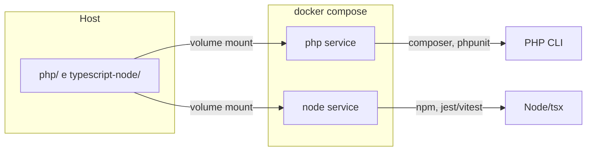

# Infraestrutura Docker para PHP e TypeScript/Node.js

## Objetivo

Ter um ambiente reproduzível para executar e testar código em **PHP** (pastas `php/clean-code/` e `php/clean-architecture/`) e **TypeScript/Node.js** (pastas `typescript-node/clean-code/` e `typescript-node/clean-architecture/`), sem depender de instalações locais de PHP/Composer ou Node/npm.

## Abordagem recomendada: dois serviços no Docker Compose

Dois serviços separados (em vez de um único container com PHP + Node) porque:

- Cada stack tem seu próprio ciclo de dependências (Composer vs npm/pnpm).
- O plano de estudos trata PHP e TypeScript em paralelo; é natural rodar um ou outro por vez.
- Imagens menores e mais claras (php:cli vs node).
- Facilita adicionar depois um serviço web (nginx + php-fpm) ou banco quando o plano chegar em "Web Is a Detail" / "Database Is a Detail".



---

## Estrutura de arquivos proposta

```
clean-code-and-architeture-with-php-and-typescript/
├── docker/
│   ├── php/
│   │   └── Dockerfile      # PHP 8.3-cli + Composer (e extensões comuns)
│   └── node/
│       └── Dockerfile      # Node 20 LTS + npm (ou pnpm)
├── docker-compose.yml      # serviços php e node, volumes, working dirs
├── .dockerignore           # ignorar node_modules, vendor, .git
├── Makefile                # (opcional) atalhos: make php-run, make node-test, etc.
└── README-DOCKER.md        # (opcional) como usar o ambiente
```

- **Não** colocar `Dockerfile` na raiz de `php/` nem `typescript-node/` para não misturar "código de estudo" com "infra"; uma pasta `docker/` (ou `infra/`) deixa isso explícito.
- **docker-compose.yml** na raiz do repositório é o padrão e permite `docker compose` a partir da raiz.

---

## Serviço PHP

- **Imagem base:** `php:8.3-cli` (ou `php:8.2-cli` se preferir LTS).
- **Extensões:** `mbstring`, `zip`, `xml`, `curl`, `pdo` (útil para exercícios de repositório/DB mais adiante); opcional `intl`.
- **Composer:** instalado globalmente no Dockerfile (`COPY --from=composer:latest`).
- **Working directory no container:** `/app/php` (ou `/app` com `php/` como subpasta), espelhando php/.
- **Volume:** montar o projeto (ou só `./php:/app/php`) para edição ao vivo.
- **Comando padrão:** `tail -f /dev/null` ou `sleep infinity` para manter o container vivo e permitir `docker compose run php composer ...` ou `docker compose run php php ...` sob demanda.
- **Uso típico:**
  - `docker compose run --rm php php clean-code/ch01/script.php`
  - `docker compose run --rm php composer install`
  - `docker compose run --rm php vendor/bin/phpunit`

---

## Serviço Node (TypeScript)

- **Imagem base:** `node:20-alpine` (ou `node:20-bookworm` se preferir Debian).
- **Working directory no container:** `/app/typescript-node` (ou `/app` com `typescript-node/` montado).
- **Volume:** montar o projeto (ou só `./typescript-node:/app/typescript-node`) para edição ao vivo.
- **Comando padrão:** `tail -f /dev/null` para execuções sob demanda.
- **Uso típico:**
  - `docker compose run --rm node npm install`
  - `docker compose run --rm node npx tsx clean-code/ch02/example.ts`
  - `docker compose run --rm node npm test` (quando houver `package.json` e scripts em `typescript-node/`).
- **Nota:** Cada subpasta (`clean-code/`, `clean-architecture/`) pode ter seu próprio `package.json` no futuro; o working dir pode ser ajustado por comando (e.g. `docker compose run --rm -w /app/typescript-node/clean-code node npm test`) ou um único `package.json` na raiz de `typescript-node/` com workspaces.

---

## docker-compose.yml (esboço)

- **Serviço `php`:**
  - build: `docker/php` (ou image: `php:8.3-cli` sem Dockerfile se não precisar de extensões extras).
  - volumes: `.:/app` (projeto inteiro em `/app`).
  - working_dir: `/app/php`.
  - stdin_open + tty: true para comandos interativos (composer, php -a).
- **Serviço `node`:**
  - build: `docker/node` (ou image: `node:20-alpine`).
  - volumes: `.:/app`.
  - working_dir: `/app/typescript-node`.
  - stdin_open + tty: true.
- **Rede:** rede default é suficiente; não é necessário expor portas para a fase inicial de estudos (CLI e testes).

---

## .dockerignore

Incluir na raiz do projeto para acelerar build e evitar vazar artefatos:

- `php/vendor/`, `typescript-node/node_modules/`, `**/node_modules/`, `**/vendor/`
- `.git/`, `.cursor/`, `*.md` (exceto se quiser copiar README)
- Arquivos de IDE e OS (`.idea/`, `.vscode/`, `.DS_Store`)

Assim o contexto de build fica pequeno e o volume mount continua sendo a fonte da verdade do código.

---

## Comandos de conveniência (opcional)

- **Makefile** na raiz com alvos como:
  - `php-shell` / `node-shell`: abrir shell no container (php ou node).
  - `php-test`: rodar PHPUnit em `php/` (quando existir).
  - `node-test`: rodar testes em `typescript-node/` (npm test ou pnpm test).
  - `php-run ARGS="..."`: executar `php ...` com os argumentos passados.
  - `node-run ARGS="..."`: executar `npx tsx ...` ou `node ...` com os argumentos passados.
- Alternativa: **scripts em `package.json` na raiz** que delegam para `docker compose run ...` (menos idiomático para PHP; Makefile é mais neutro para as duas stacks).

---

## Evolução futura (fora do escopo inicial)

- **Web:** Quando o plano chegar em "Web Is a Detail", adicionar um serviço `nginx` + `php-fpm` (ou um único container com `php:8.3-fpm`) e outro com `node` servindo Express/Nest; expor portas (ex.: 8080 para PHP, 3000 para Node).
- **Banco:** Serviço `db` (PostgreSQL ou MySQL) para os capítulos "Database Is a Detail"; variáveis de ambiente e conexão apenas nos adaptadores.
- **Um único container "dev"** com PHP + Node pode ser um terceiro serviço opcional (ex.: `dev`) para quem quiser rodar os dois lados em um único shell; não substitui os serviços dedicados para CI ou para rodar só uma stack.

---

## Resumo do que implementar

1. **docker/php/Dockerfile** – PHP 8.3-cli, Composer, extensões (mbstring, zip, xml, curl, pdo).
2. **docker/node/Dockerfile** – Node 20 (Alpine ou Bookworm); pode ser só `FROM node:20-alpine` sem passos extras no início.
3. **docker-compose.yml** – serviços `php` e `node`, volume `.:/app`, working dirs `/app/php` e `/app/typescript-node`, `stdin_open: true`, `tty: true`.
4. **.dockerignore** na raiz – vendor, node_modules, .git, etc.
5. **Makefile** (opcional) – alvos php-shell, node-shell, php-test, node-test, php-run, node-run.
6. **README-DOCKER.md** (opcional) – como subir o ambiente e exemplos de comandos.

Nenhuma alteração em PLANO_ESTUDOS.md ou nas pastas de exercícios é obrigatória; o plano de estudos continua válido e o Docker fica como camada de infraestrutura opcional para quem quiser usar.
